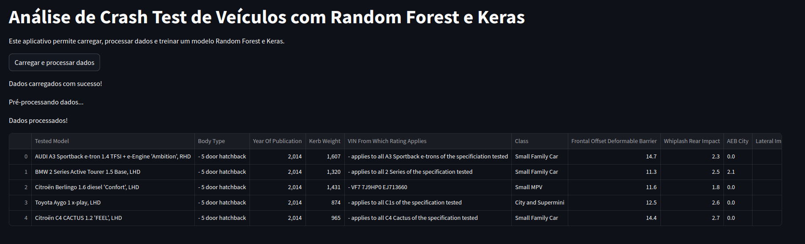
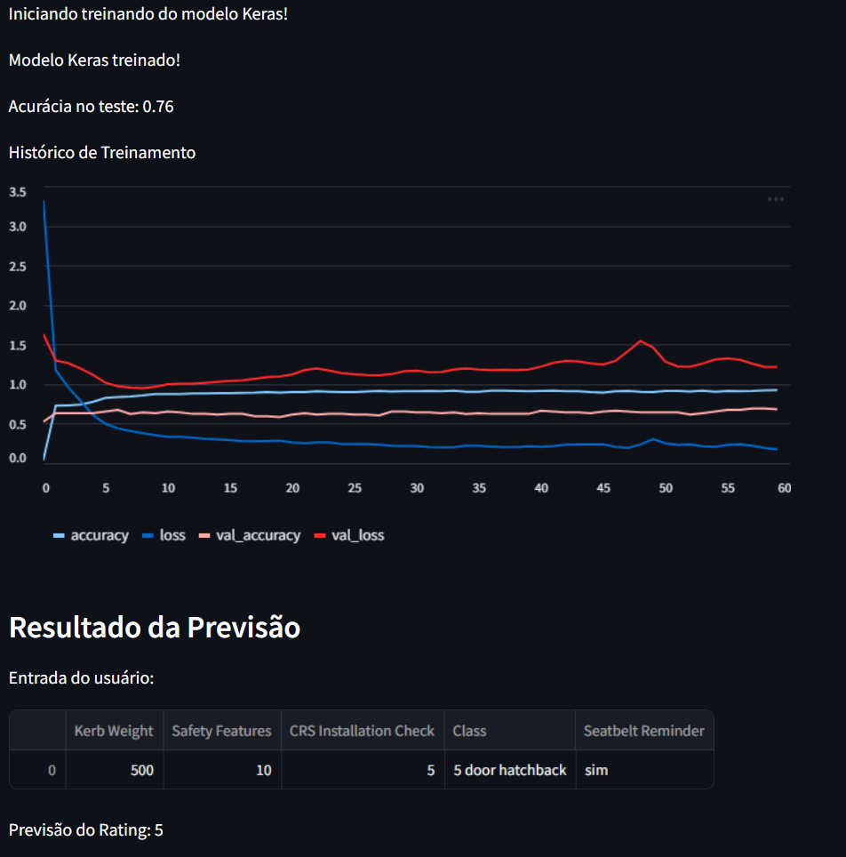

# Crash Test
Repositório utilizado para os códigos do trabalho semestral da disciplina ECM514 - Ciência de Dados. 

<!---
COMO CRIAR UM SUMARIO/TABLE OF CONTENTS
the Markdown All in One plugin (extension).

To install it, launch the VS Code Quick Open (Control/⌘+P), paste the following command, and press enter.

ext install yzhang.markdown-all-in-one

To generate the TOC, open the command palette (Control/⌘+Shift+P) and select the Markdown All in One: Create Table of Contents option.
-->
- [Crash Test](#crash-test)
  - [🧑🏻‍💻 Integrantes](#-integrantes)
  - [🚩 Sobre o Projeto](#-sobre-o-projeto)
- [🔧Documentação do Projeto](#documentação-do-projeto)
  - [📌 scrappingNew.py](#-scrappingnewpy)
    - [Descrição](#descrição)
    - [Funcionalidades](#funcionalidades)
    - [Dependências](#dependências)
    - [Estrutura do Script](#estrutura-do-script)
      - [Função `criar_df(url)`](#função-criar_dfurl)
      - [Processamento Paralelo com `ThreadPoolExecutor`](#processamento-paralelo-com-threadpoolexecutor)
    - [Saída e Armazenamento dos Dados:](#saída-e-armazenamento-dos-dados)
- [📊 Conclusões](#-conclusões)
  - [🚀 Funcionamento](#-funcionamento)
  - [📽️ Video](#️-video)
  - [📝 Artigo](#-artigo)
  - [🛜 Links do Colab](#-links-do-colab)


## 🧑🏻‍💻 Integrantes
Nome: Caio Rabinovich Panes Brunholi 		RA: 20.01285-3 

Nome: Felippe Onishi Yaegashi 				RA: 20.00255-6

Nome: Jonathan Martins Gomes  			    RA: 20.00862-7

Nome: Matheus Marins Bernardello 			RA: 20.00286-6

## 🚩 Sobre o Projeto 
O projeto escolhido é do tipo 2, Tabular Data Classification
Ele irá focar no uso de dados obtidos a partir de web scraping e/ou uso de APIs, focando nos métodos tradicionais de Machine Learning para classificação de dados.

O projeto baseia-se na obtenção de dados de dados de colisão de veículos (crash test) utilizando técnicas de web scraping e/ou uso de APIs dos órgão classificadores, mais especiificamente o [EURONCAP](https://www.euroncap.com/en).

>O EURONCAP foi escolhido, pois ele tem publicado em seu website o teste de mais veículos que o LATINCAP, e possui uma formatação mais padronizada e completa que os demais órgãos classificadores.

Esses órgãos realizam testes de colisão e publicam os resultados, assim como os dados técnicos dos veículos. Após os testes, o estado dos veículos e dos bonecos de teste de colisão (crash dummies), também conhecidos como Dispositivos Antropomórficos de Teste são analisados. 

Então o veículo recebe uma **classificação geral de segurança categórica, as estrelas, que variam de 0 a 5, sendo 0 um veículo pouco seguro e 5 um altamente seguro**.
O objetivo do projeto é analisar os dados históricos dos testes, relacionando, por exemplo, a marca, tipo de veículo, especificações técnicas, entre outros, e conseguir prever as classificações de novos modelos de carros antes da realização dos ensaios destrutivos.

O desenvolvimento será realizado utilizando o Google Colab e demais ferramentas auxiliares conforme a necessidade, fornecendo ao usuário final uma interface em que ele poderá inserir os dados do novo veículo e obter sua classificação estimada (quantas estrelas ele terá).

</br>

# 🔧Documentação do Projeto
O Projeto é composto de 3 arquivos principais:
- scrappingNew.py
- CD.ipynb
- StreamlitCD.ipynb

Os arquivos `.ipynb` são os notebooks que podem ser executados diretamente no Google Colab. Já o arquivo `.py` é um script que deve ser executado diretamente. Para isso é necessário instalar as bibliotecas:
```bash
pip install -r /path/to/requirements.txt
```  

## 📌 scrappingNew.py
### Descrição
Este script realiza web scraping no site do EURONCAP para coletar dados estruturados de elementos HTML específicos. Ele usa a biblioteca `requests` para fazer requisições HTTP e o `BeautifulSoup` para processar o HTML e extrair informações relevantes. Os dados coletados são organizados em um DataFrame do `pandas`, facilitando a análise e exportação para outros formatos de dados. Além disso, o script utiliza o `ThreadPoolExecutor` para realizar múltiplas requisições de forma paralela, melhorando a eficiência e diminuindo o tempo de execução ao processar grandes conjuntos de URLs.

### Funcionalidades
- **Requisição de Páginas da Web:** Para cada URL fornecida, o script envia uma requisição HTTP, obtendo o conteúdo da página HTML.
- **Parsing do HTML:** Com o `BeautifulSoup`, o script identifica elementos HTML de interesse (por exemplo, `div` com uma classe específica) e extrai o conteúdo desses elementos.
- **Armazenamento de Dados:** Os dados coletados são organizados em um DataFrame do `pandas` para facilitar análises e manipulações adicionais.
- **Processamento Paralelo:** Através do `ThreadPoolExecutor`, o script executa múltiplas requisições simultaneamente, o que é particularmente útil quando se lida com um grande número de URLs.

### Dependências
O script requer as seguintes bibliotecas Python:
- `requests` para realizar requisições HTTP.
- `beautifulsoup4` para parsing e extração de dados do HTML.
- `pandas` para organização e manipulação dos dados extraídos.
- 
### Estrutura do Script

O script importa as bibliotecas necessárias e define uma função chamada `criar_df`, que é responsável pela maior parte do processo de scraping e extração de dados. Além disso, ele define o cabeçalho `User-Agent` para simular um navegador e minimizar bloqueios.

```python
import requests
from bs4 import BeautifulSoup
import pandas as pd
import os
from concurrent.futures import ThreadPoolExecutor
```

#### Função `criar_df(url)`

Esta função é o núcleo do script. Ela executa os seguintes passos:

1. **Log de Início:** Exibe uma mensagem de log indicando o início do processamento da URL, útil para monitoramento e debug.

2. **Configuração do User-Agent:** Define um `User-Agent` para a requisição, simulando um navegador real e evitando bloqueios comuns durante o scraping.

    ```python
    headers = {'User-Agent': "Mozilla/5.0 ... Safari/537.36"}
    ```

3. **Requisição HTTP:** Envia uma requisição GET para a URL usando a biblioteca `requests`, passando o cabeçalho com o `User-Agent`.

    ```python
    request = requests.get(url, headers=headers)
    ```

4. **Parsing do HTML:** Após receber a resposta, o conteúdo HTML da página é analisado pelo `BeautifulSoup`. A função `soup.find_all` é usada para localizar elementos específicos de interesse (por exemplo, `div` com classes específicas).

    ```python
    soup = BeautifulSoup(request.content, 'html.parser')
    atributos1 = soup.find_all('div', class_='...')
    ```

5. **Extração de Dados:** Utiliza seletores de HTML específicos para coletar os dados desejados de cada elemento HTML identificado.

6. **Estruturação dos Dados:** Organiza os dados coletados em uma estrutura apropriada e os insere em um DataFrame do `pandas` para facilitar a manipulação e análise.

#### Processamento Paralelo com `ThreadPoolExecutor`

Para processar várias URLs simultaneamente, o script usa `ThreadPoolExecutor`, que executa múltiplas instâncias da função `criar_df` em paralelo. Isso permite que o script faça scraping em várias páginas da web ao mesmo tempo, economizando tempo em comparação com uma execução sequencial.

```python
with ThreadPoolExecutor(max_workers=5) as executor:
    executor.map(criar_df, urls)
```

Neste exemplo, `max_workers=5` limita o número de threads a 5, mas este valor pode ser ajustado com base na quantidade de URLs e na capacidade do sistema.


### Saída e Armazenamento dos Dados: 
O DataFrame resultante é r exportado para um arquivo CSV, permitindo fácil integração com outras ferramentas e softwares de análise de dados.

</br>

# 📊 Conclusões
## 🚀 Funcionamento



## 📽️ Video

## 📝 Artigo

## 🛜 Links do Colab

[Colab](https://colab.research.google.com/drive/1TCuvs70iniyzbc2-su6D5rB1eK1FduuT#scrollTo=NXIfPvveenWZ)


[Colab + Streamlit](https://colab.research.google.com/drive/1uKFoF86mV_WHvfIHBgtEZboCqDZWK69-?usp=sharing#scrollTo=D5yN_vbT80-p)
