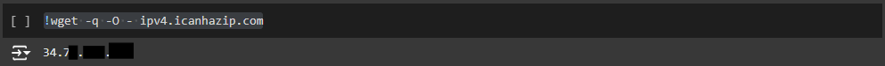
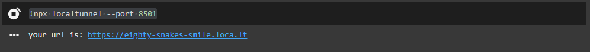
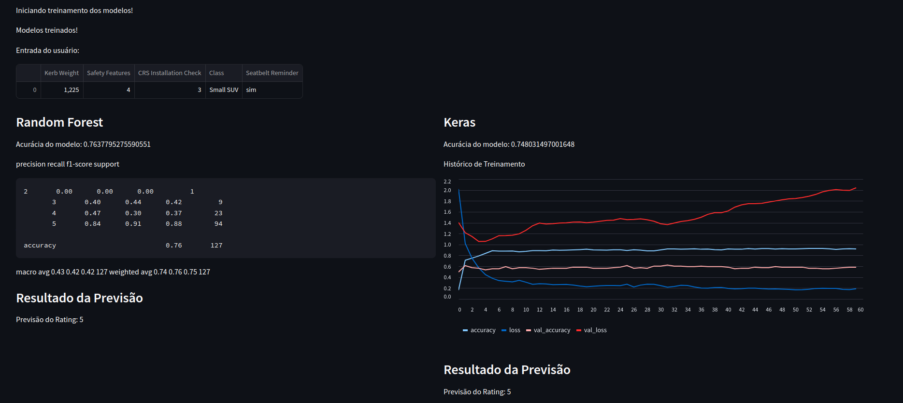

# Crash Test
Repositório utilizado para os códigos do trabalho semestral da disciplina ECM514 - Ciência de Dados. 

<!---
COMO CRIAR UM SUMARIO/TABLE OF CONTENTS
the Markdown All in One plugin (extension).

To install it, launch the VS Code Quick Open (Control/⌘+P), paste the following command, and press enter.

ext install yzhang.markdown-all-in-one

To generate the TOC, open the command palette (Control/⌘+Shift+P) and select the Markdown All in One: Create Table of Contents option.
-->

- [Crash Test](#crash-test)
  - [🧑🏻‍💻 Integrantes](#-integrantes)
  - [🚩 Sobre o Projeto](#-sobre-o-projeto)
- [🔧Documentação do Projeto](#documentação-do-projeto)
  - [📌 scrappingNew.py](#-scrappingnewpy)
    - [Descrição](#descrição)
    - [Funcionalidades](#funcionalidades)
    - [Dependências](#dependências)
    - [Estrutura do Script](#estrutura-do-script)
      - [Função `criar_df(url)`](#função-criar_dfurl)
      - [Processamento Paralelo com `ThreadPoolExecutor`](#processamento-paralelo-com-threadpoolexecutor)
    - [Saída e Armazenamento dos Dados:](#saída-e-armazenamento-dos-dados)
  - [📌 CD.ipynb](#-cdipynb)
    - [Descrição](#descrição-1)
      - [Funcionalidades](#funcionalidades-1)
    - [Estrutura do Notebook](#estrutura-do-notebook)
    - [Escolha do Modelo](#escolha-do-modelo)
    - [Fonte dos Dados](#fonte-dos-dados)
  - [📌 StreamlitCD_RF_Keras.ipynb](#-streamlitcd_rf_kerasipynb)
    - [Descrição](#descrição-2)
    - [Funcionalidades](#funcionalidades-2)
    - [Estrutura](#estrutura)
- [📊 Conclusões](#-conclusões)
  - [🚀 Funcionamento e Como Utilizar](#-funcionamento-e-como-utilizar)
  - [📽️ Video](#️-video)
  - [📝 Artigo](#-artigo)
  - [🛜 Links do Colab](#-links-do-colab)


## 🧑🏻‍💻 Integrantes
Nome: Caio Rabinovich Panes Brunholi 		RA: 20.01285-3 

Nome: Felippe Onishi Yaegashi 				RA: 20.00255-6

Nome: Jonathan Martins Gomes  			    RA: 20.00862-7

Nome: Matheus Marins Bernardello 			RA: 20.00286-6

## 🚩 Sobre o Projeto 
O projeto escolhido é do tipo 2, Tabular Data Classification
Ele irá focar no uso de dados obtidos a partir de web scraping e/ou uso de APIs, focando nos métodos tradicionais de Machine Learning para classificação de dados.

O projeto baseia-se na obtenção de dados de dados de colisão de veículos (crash test) utilizando técnicas de web scraping e/ou uso de APIs dos órgão classificadores, mais especificamente o [EURONCAP](https://www.euroncap.com/en).

>O EURONCAP foi escolhido, pois ele tem publicado em seu website o teste de mais veículos que o LATINCAP, e possui uma formatação mais padronizada e completa que os demais órgãos classificadores.

Esses órgãos realizam testes de colisão e publicam os resultados, assim como os dados técnicos dos veículos. Após os testes, o estado dos veículos e dos bonecos de teste de colisão (crash dummies), também conhecidos como Dispositivos Antropomórficos de Teste são analisados. 

Então o veículo recebe uma **classificação geral de segurança categórica, as estrelas, que variam de 0 a 5, sendo 0 um veículo pouco seguro e 5 um altamente seguro**.
O objetivo do projeto é analisar os dados históricos dos testes, relacionando, por exemplo, a marca, tipo de veículo, especificações técnicas, entre outros, e conseguir prever as classificações de novos modelos de carros antes da realização dos ensaios destrutivos.

O desenvolvimento será realizado utilizando o Google Colab e demais ferramentas auxiliares conforme a necessidade, fornecendo ao usuário final uma interface em que ele poderá inserir os dados do novo veículo e obter sua classificação estimada (quantas estrelas ele terá).

</br>

# 🔧Documentação do Projeto
O Projeto é composto de 3 arquivos principais:
- scrappingNew.py
- CD.ipynb
- StreamlitCD_RF_Keras.ipynb

Os arquivos `.ipynb` são os notebooks que podem ser executados diretamente no Google Colab. Já o arquivo `.py` é um script que deve ser executado diretamente. Para isso é necessário instalar as bibliotecas:
```bash
pip install -r ./requirements.txt
```  

## 📌 scrappingNew.py
### Descrição
Este script realiza web scraping no site do EURONCAP para coletar dados estruturados de elementos HTML específicos. Ele usa a biblioteca `requests` para fazer requisições HTTP e o `BeautifulSoup` para processar o HTML e extrair informações relevantes. Os dados coletados são organizados em um DataFrame do `pandas`, facilitando a análise e exportação para outros formatos de dados. Além disso, o script utiliza o `ThreadPoolExecutor` para realizar múltiplas requisições de forma paralela, melhorando a eficiência e diminuindo o tempo de execução ao processar grandes conjuntos de URLs.

### Funcionalidades
- **Requisição de Páginas da Web:** Para cada URL fornecida, o script envia uma requisição HTTP, obtendo o conteúdo da página HTML.
- **Parsing do HTML:** Com o `BeautifulSoup`, o script identifica elementos HTML de interesse (por exemplo, `div` com uma classe específica) e extrai o conteúdo desses elementos.
- **Armazenamento de Dados:** Os dados coletados são organizados em um DataFrame do `pandas` para facilitar análises e manipulações adicionais.
- **Processamento Paralelo:** Através do `ThreadPoolExecutor`, o script executa múltiplas requisições simultaneamente, o que é particularmente útil quando se lida com um grande número de URLs.

### Dependências
O script requer as seguintes bibliotecas Python:
- `requests` para realizar requisições HTTP.
- `beautifulsoup4` para parsing e extração de dados do HTML.
- `pandas` para organização e manipulação dos dados extraídos.
- 
### Estrutura do Script

O script importa as bibliotecas necessárias e define uma função chamada `criar_df`, que é responsável pela maior parte do processo de scraping e extração de dados. Além disso, ele define o cabeçalho `User-Agent` para simular um navegador e minimizar bloqueios.

```python
import requests
from bs4 import BeautifulSoup
import pandas as pd
import os
from concurrent.futures import ThreadPoolExecutor
```

#### Função `criar_df(url)`

Esta função é o núcleo do script. Ela executa os seguintes passos:

1. **Log de Início:** Exibe uma mensagem de log indicando o início do processamento da URL, útil para monitoramento e debug.

2. **Configuração do User-Agent:** Define um `User-Agent` para a requisição, simulando um navegador real e evitando bloqueios comuns durante o scraping.

    ```python
    headers = {'User-Agent': "Mozilla/5.0 ... Safari/537.36"}
    ```

3. **Requisição HTTP:** Envia uma requisição GET para a URL usando a biblioteca `requests`, passando o cabeçalho com o `User-Agent`.

    ```python
    request = requests.get(url, headers=headers)
    ```

4. **Parsing do HTML:** Após receber a resposta, o conteúdo HTML da página é analisado pelo `BeautifulSoup`. A função `soup.find_all` é usada para localizar elementos específicos de interesse (por exemplo, `div` com classes específicas).

    ```python
    soup = BeautifulSoup(request.content, 'html.parser')
    atributos1 = soup.find_all('div', class_='...')
    ```

5. **Extração de Dados:** Utiliza seletores de HTML específicos para coletar os dados desejados de cada elemento HTML identificado.

6. **Estruturação dos Dados:** Organiza os dados coletados em uma estrutura apropriada e os insere em um DataFrame do `pandas` para facilitar a manipulação e análise.

#### Processamento Paralelo com `ThreadPoolExecutor`

Para processar várias URLs simultaneamente, o script usa `ThreadPoolExecutor`, que executa múltiplas instâncias da função `criar_df` em paralelo. Isso permite que o script faça scraping em várias páginas da web ao mesmo tempo, economizando tempo em comparação com uma execução sequencial.

```python
with ThreadPoolExecutor(max_workers=5) as executor:
    executor.map(criar_df, urls)
```

Neste exemplo, `max_workers=5` limita o número de threads a 5, mas este valor pode ser ajustado com base na quantidade de URLs e na capacidade do sistema.


### Saída e Armazenamento dos Dados: 
O DataFrame resultante é r exportado para um arquivo CSV, permitindo fácil integração com outras ferramentas e softwares de análise de dados.

</br>

## 📌 CD.ipynb
### Descrição
Este notebook realiza uma análise de dados sobre testes de colisão de veículos, com o objetivo de explorar e prever características de segurança dos veículos com base em várias métricas de segurança. O fluxo de trabalho inclui carregamento, limpeza, transformação de dados e treinamento e avaliação de um modelo de aprendizado de máquina.

#### Funcionalidades
- **Carregamento e Limpeza de Dados:** Carrega o conjunto de dados de crash test e realiza transformações nas colunas, incluindo remoção de unidades e conversão de tipos.
- **Tratamento de Dados Faltantes:** Identifica colunas numéricas com valores ausentes e os preenche usando valores aleatórios dentro da faixa de média ± desvio padrão.
- **Treinamento e Avaliação de Modelo:** Treina um classificador Random Forest para prever resultados de segurança com base em características dos veículos e gera métricas de avaliação do modelo.

### Estrutura do Notebook

1. **Importação das Bibliotecas**: Inclui `pandas`, `numpy` e módulos do `scikit-learn` para manipulação de dados e aprendizado de máquina.
2. **Carregamento dos Dados**: Lê os dados de um arquivo CSV e exibe as primeiras linhas para visualização inicial.
3. **Limpeza e Transformação**:
   - Remove unidades de medidas em colunas específicas (por exemplo, remove "kg" da coluna de peso).
   - Converte as colunas para tipos apropriados para facilitar a análise.
4. **Tratamento de Valores Ausentes**:
   - Identifica colunas numéricas e preenche valores ausentes com números aleatórios, gerados dentro da faixa da média ± desvio padrão da coluna correspondente.
5. **Treinamento e Avaliação de Modelo**:
   - Divide o conjunto de dados em treinamento e teste.
   - Treina um classificador `RandomForestClassifier` para prever resultados de segurança dos veículos.
   - Avalia o modelo usando métricas como acurácia e relatório de classificação.

### Escolha do Modelo
O modelo escolhido, `RandomForestClassifier`, é um método de aprendizado baseado em árvores de decisão e apresenta vantagens específicas para análise de dados de segurança de veículos:

1. **Robustez e Capacidade de Generalização**: 
   O Random Forest é composto de múltiplas árvores de decisão, o que permite uma maior capacidade de generalização, reduzindo o risco de overfitting. Isso é especialmente útil para dados complexos e com possíveis interações entre variáveis, como os encontrados em dados de crash test.

2. **Interpretação e Importância das Variáveis**:
   Uma característica essencial do Random Forest é a capacidade de avaliar a importância das variáveis, possibilitando a identificação das métricas de segurança que mais influenciam a classificação de segurança dos veículos.

3. **Manejo de Dados Desbalanceados e Valores Faltantes**:
   A construção aleatória de amostras para cada árvore permite que o modelo lide bem com dados desbalanceados. Além disso, o Random Forest é relativamente robusto a valores faltantes, o que o torna uma boa escolha dado que o conjunto de dados original apresenta valores ausentes.

Essas qualidades tornam o `RandomForestClassifier` adequado para o tipo de análise que estamos realizando, focada em prever com precisão a segurança dos veículos com base em uma série de variáveis complexas e possivelmente interdependentes.

### Fonte dos Dados
O notebook carrega os dados de um link para um arquivo CSV com os dados já coletados do web scrapping; 

</br>

## 📌 StreamlitCD_RF_Keras.ipynb
### Descrição
Esse arquivo possui o mesmo código que `CD.ipynb` tratando-se da análise dos dados e treinamento do modelo. Porém foram feitas as modificações necessárias para criar um frontend Streamlit

### Funcionalidades
- **Carregamento e Limpeza de Dados**: O aplicativo carrega um conjunto de dados de crash test e realiza transformações em colunas específicas, incluindo a remoção de unidades e conversão de valores para tipos apropriados.
- **Treinamento de Modelo Keras**: Treina um modelo de rede neural utilizando o Keras para prever a classificação de segurança do veículo com base em variáveis selecionadas, em paralelo treina um modelo do Random Forest para efeito comparativo.
- **Interface Interativa**: Permite ao usuário inserir características de veículos e ver a previsão do modelo em tempo real.
- **Visualização de Desempenho do Modelo**: Mostra a acurácia dos modelos e gráficos de histórico de treinamento do Keras a resultados do Random Forest.

### Estrutura 
1. **Configuração do Ambiente**:
   - Instala o Streamlit, Keras, e usa o Localtunnel para expor a aplicação local para a internet.
  
2. **Interface do Streamlit**:
   - Define a interface interativa com Streamlit, que inclui entradas para variáveis como peso do veículo, nota de segurança, facilidade de instalação de cadeirinha infantil, entre outras.
   
3. **Funções Principais**:
   - `load_data()`: Carrega os dados de um link CSV e faz a limpeza necessária.
   - `preprocess_data(data)`: Preenche valores ausentes nas colunas numéricas com valores gerados aleatoriamente dentro da faixa de média ± desvio padrão.
   - `train_keras_model(data)`: Treina um modelo de rede neural com Keras, utilizando variáveis categóricas e numéricas após pré-processamento, e avalia o modelo com métricas de acurácia.
   - `user_input_features()`: Interface para coletar dados do usuário sobre o veículo para previsão.

4. **Treinamento e Avaliação**:
   - Exibe a acurácia do modelo e o gráfico de histórico de treinamento usando Streamlit.
   - Gera a previsão para as entradas fornecidas pelo usuário.


</br>

# 📊 Conclusões
## 🚀 Funcionamento e Como Utilizar
Para utilizar o script com frontend Streamlit `StreamlitCD_RF_Keras.ipynb` executa-se todas as células. Abaixo da célula `!wget -q -O - ipv4.icanhazip.com` irá aparecer o IP público:


Já abaixo da célula `!npx localtunnel --port 8501` aparecerá um link:


Ao acessá-lo você será apresentado à interface do projeto

> Caso seja apresentado a uma página pedindo uma senha, ela será o IP público descrito acima




## 📽️ Video

[Apresentação](https://youtu.be/lfoUzBCEqUY)

## 📝 Artigo

[Artigo-Projeto](Documents/Artigo%20Projeto%20Semestral%20-%20Ciência%20de%20Dados.pdf)

## 🛜 Links do Colab

[Colab](https://colab.research.google.com/drive/1HpAjbqDpC8de666-JAOfuM6hRL4bSq3z?usp=sharing)


[Colab + Streamlit](https://colab.research.google.com/drive/1gC_xmsHEnGcACMlSZxwAi528CsnVk-4x?usp=sharing)

[Como usar Streamlit no Colab](https://medium.com/@yash.kavaiya3/running-streamlit-code-in-google-colab-involves-a-few-steps-c43ea0e8c0d9)